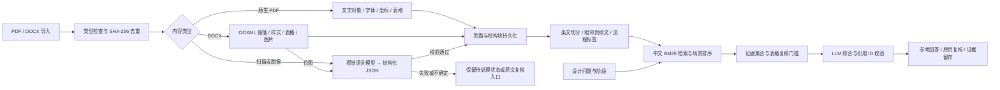

# 技术架构

## 数据流

这是处理流程示意图，产品中没有知识图谱展示、图谱接口或图数据库依赖。

## 模块边界

| 文件 | 职责 |
|---|---|
| `app/config.py` | `.env`、资料根目录和服务实例标识 |
| `app/store.py` | SQLite 事务、数据表、模型设置、相对原文定位和旧路径迁移 |
| `app/pipeline.py` | PDF / DOCX 导入、视觉任务、页级恢复、证据重建 |
| `app/models.py` | Chat Completions 兼容调用、密钥读取、JSON 和结构检查 |
| `app/ontology.py` | 六个设计阶段、主题词和同义词规则；无图谱实现 |
| `app/retrieval.py` | BM25、场景辅助排序、证据选择、回答和引用校验 |
| `app/main.py` | FastAPI 接口、Host 与来源限制、上传和原文服务 |
| `app/static/` | 无构建步骤的中文单页界面 |
| `launcher.py` / `manage.py` | 启动、停止、检查、私人数据备份与 Git 更新 |
| `tests/test_system.py` | 合成文件和模拟模型的端到端回归 |

## 数据模型

`documents` 保存哈希、原文定位、版本提示及文档状态；`pages` 保存页或 Word 块、方法、解析状态、尺寸及人工复核标记；`blocks` 保存段落、标题、表格、图示、区域及结构详情；`chunks` 保存用于检索的条文、页面范围、标签和来源。

`jobs` / `events` 记录处理进度；`history` 保存查询回答；`bookmarks` 保存证据收藏；`settings` 保存不含密钥的模型配置。`metadata` 与数据库触发器维护语料修订号，使内存检索缓存随内容变化失效。数据访问使用参数化 SQL 和事务。

受管理原文件使用 `sources:相对路径` 或 `data:imports/文件名` 定位，按当前配置根目录解析并检查越界。旧版绝对路径迁移采用 SHA-256 校验。数据库迁移不会复制原文件；备份恢复必须同时携带原文和图片资源。

## 处理与检索实现

原生 PDF 读取对象而非 OCR；扫描和 Word 位图经视觉模型解释。VLM 请求前将页面渲染为长边最多约 2200 像素的图像，不改变原文件。高度密集的表格可能需要未来增加分区解析。

后台文档任务串行调度，每个视觉批次最多并发三个模型请求，PDF 操作通过锁串行保护。成功页保存，连续失败停止批次；重新运行时跳过成功页面。停止发生在当前请求完成后，不能撤回已经发送到服务商的请求或费用。

`indexed` 代表机器解析成功；`reviewed` 独立标记人工复核，模型不能自动将其设为完成。被标记不确定的 VLM 块保留供查看，但不作为可靠回答证据。复杂续表尚不保证语义自动合并。

查询采用中文二/三字片段、英文/数字/条号 token、BM25 和场景规则排序；支持阶段、文件、内容类型筛选。回答最多选取七条证据，没有调用向量数据库。未复核表格数值不传给回答模型，但仍可在原文和检索结果中浏览。

模型输出使用结构化 JSON 并校验来源编号。不存在的引用触发原文回退；引用存在不等于语义充分支持。无匹配证据明确拒绝生成结论，不借用模型记忆补写工程数值。

## 安全与数据发送

服务绑定回环地址，限制 Host 和跨源修改请求，并设置 CSP。上传接受 PDF / DOCX，单文件上限 150 MB，清理文件名并检查基本签名；这不等同于完整病毒扫描或恶意文档沙箱。

密钥只从服务进程环境读取，也可由本机 `.env` 注入；环境变量优先，密钥不进入数据库或前端。远程模型要求 HTTPS 和显式启用资料发送，模型客户端不跟随重定向，不把完整提供方错误响应返回前端。本地检索不需要外发内容；远程解析发送页面图像，远程回答发送问题和检索证据。

数据库、原件、备份和历史默认未加密，应依赖本机磁盘权限及备份管理保护。本版没有账号、权限、多租户、并发配额或对所有文档提示注入的形式化防护，不应直接暴露给不可信网络。

## 扩展顺序

先建设版本台账和专业题集，再改善多级表头、单位、否定措辞及数值校验。用实际召回质量评估是否添加语义嵌入和重排。需要团队部署时增加认证、上传安全隔离、任务队列、审计和监控。设计清单与条件核查应基于经过专业审定的规则，不从关键词标签直接推导合规。
